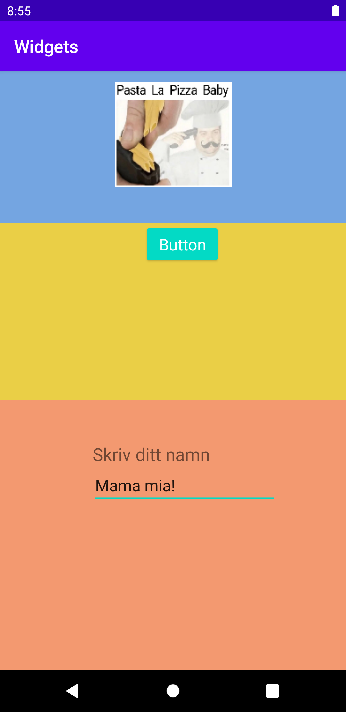

# Rapport


```
                app:layout_constraintBottom_toBottomOf="parent"
                app:layout_constraintEnd_toEndOf="parent"
                app:layout_constraintStart_toStartOf="parent"
                app:layout_constraintTop_toBottomOf="@id/text1" 
```
Koden ovan är ifrån viewn EditText som är en textfält som användaren kan skiva in egen text. I koden visas de constraints som den använder sig av. Att till höger, vänster och nedåt så constrainar den sig emot parent, vilket är skärmens storlek. Consteint uppåt sker genom att constraina EditTexts top emot viewn med id "text1" som ligger ovanför.


 


